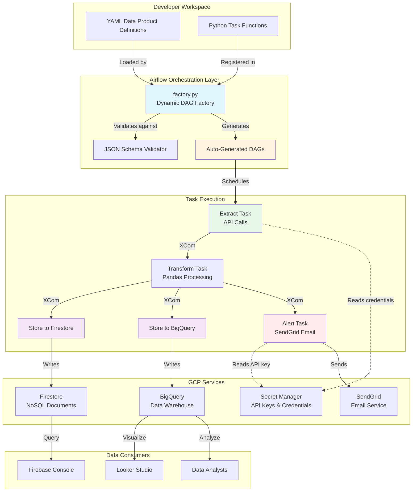
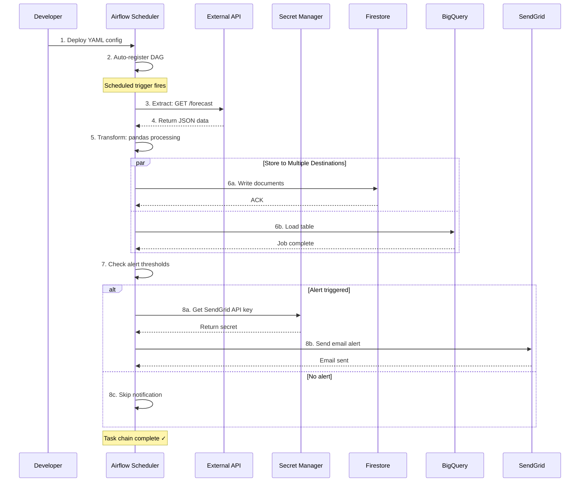

# 🚀 Enterprise Data Product Factory with Airflow & GCP

A scalable, containerized, configuration-driven orchestration platform built on **Apache Airflow** that automates data ingestion, transformation, and storage into **Firestore** and **BigQuery**.

This project introduces a **declarative DAG factory** pattern that dynamically registers data products from YAML definitions—eliminating manual DAG editing and ensuring consistency, governance, and scalability at enterprise scale.

---

## 📋 Table of Contents

- [Why This Project](#-why-this-project)
- [Architecture Overview](#%EF%B8%8F-architecture-overview)
- [Project Structure](#-project-structure)
- [Prerequisites](#-prerequisites)
- [Installation](#-installation)
  - [GCP Setup](#1-gcp-setup)
  - [Local Development Setup](#2-local-development-setup)
- [Usage](#-usage)
- [Testing](#-testing)
- [Adding New Data Products](#-adding-new-data-products)
- [Security Best Practices](#-security-best-practices)
- [Troubleshooting](#-troubleshooting)
- [Deployment to Cloud Composer](#-deployment-to-cloud-composer)
- [Maintenance](#-maintenance)
- [Roadmap](#-roadmap)

---

## 🧩 Why This Project

Traditional data pipelines are tightly coupled to specific data flows, making them difficult to scale and maintain. This project solves that by:

- **Configuration-Driven**: Define data products in YAML—no code changes needed
- **Auto-Discovery**: Automatically registers all data products at runtime
- **Provider-Agnostic**: No hard dependencies on specific cloud operators
- **Enterprise-Grade**: Schema validation, CI/CD testing, and secure credential management
- **Scalable**: Mirrors practices used at Google, Meta, and Amazon

---

## ⚙️ Architecture Overview

### Stack

| Component | Technology | Purpose |
|-----------|-----------|---------|
| **Orchestration** | Apache Airflow 2.10 | Workflow management & scheduling |
| **Language** | Python 3.11 | Task execution & data processing |
| **NoSQL Storage** | Firebase Firestore | Document-based real-time data |
| **Analytics** | Google BigQuery | Data warehousing & analysis |
| **Notifications** | SendGrid | Email alerting system |
| **Secrets** | GCP Secret Manager | Secure credential storage |
| **Local Development** | Docker Compose + PostgreSQL | Containerized environment |

### System Architecture



### Data Flow



### Key Features

✅ **Dynamic DAG Generation**: Auto-discovers YAML files in `/dags/products/`  
✅ **JSON Schema Validation**: Ensures configuration integrity  
✅ **Modular Task Design**: All Python tasks in `operators/custom_ops.py`  
✅ **Clean Separation**: Extract → Store → Alert pattern  
✅ **CI/CD Ready**: Automated testing with pytest  
✅ **Cloud-Native**: Designed for Cloud Composer deployment

---

## 📁 Project Structure

```
data_product_factory/
├── dags/
│   ├── factory.py                      # Dynamic DAG factory engine
│   ├── utils.py                        # YAML & schema validation helpers
│   ├── schemas/
│   │   └── data_product_schema.json    # JSON schema for YAML validation
│   └── products/
│       ├── weather_data_product.yaml   # Example: Weather pipeline
│       └── sales_data_product.yaml     # Example: Sales pipeline
│
├── operators/
│   ├── __init__.py                     # Auto-registers task functions
│   └── custom_ops.py                   # All @task decorated functions
│
├── tests/
│   ├── conftest.py                     # pytest configuration
│   ├── test_schema_validation.py       # Validates YAML against schema
│   └── test_dag_integrity.py           # Ensures DAGs load without errors
│
├── Dockerfile                          # Multi-stage Airflow image
├── docker-compose.yml                  # Local orchestration setup
├── requirements.txt                    # Python dependencies
├── .env.example                        # Environment variables template
├── .dockerignore                       # Build optimization
├── .gitignore                          # Security (credentials excluded)
└── README.md                           # This file
```

---

## 📋 Prerequisites

### Required Tools

| Tool | Minimum Version | Purpose |
|------|----------------|---------|
| **Python** | 3.11+ | Local development & testing |
| **Docker** | 24.0+ | Container runtime |
| **Docker Compose** | 2.20+ | Multi-service orchestration |
| **gcloud CLI** | Latest | GCP configuration |
| **Git** | 2.0+ | Version control |

### Required GCP Resources

- **GCP Project** with billing enabled
- **Firebase Project** (for Firestore)
- **SendGrid Account** (free tier available)
- **Service Account** with appropriate IAM roles

### Required Permissions

Your GCP service account needs:

```
roles/bigquery.dataEditor
roles/bigquery.jobUser
roles/datastore.user
roles/secretmanager.secretAccessor
```

---

## 🛠 Installation

### 1. GCP Setup

#### Step 1.1: Create Firebase Project

1. Go to [Firebase Console](https://console.firebase.google.com)
2. Create a new project or select existing
3. Navigate to **Project Settings → Service Accounts**
4. Click **Generate New Private Key**
5. Save as `firebase-credentials.json` in project root
6. **Add to `.gitignore`** (already included)

#### Step 1.2: Enable Required APIs

```bash
gcloud services enable \
  firestore.googleapis.com \
  bigquery.googleapis.com \
  secretmanager.googleapis.com \
  composer.googleapis.com
```

#### Step 1.3: Create SendGrid API Key

1. Sign up at [SendGrid](https://sendgrid.com)
2. Navigate to **Settings → API Keys**
3. Create new API key with **Full Access**
4. Copy the key (you'll use it in next step)

#### Step 1.4: Store Secrets in Secret Manager

```bash
# Set your project ID
export GCP_PROJECT="your-project-id"
gcloud config set project $GCP_PROJECT

# Store SendGrid API key
echo -n "your-sendgrid-api-key" | \
  gcloud secrets create SENDGRID_API_KEY --data-file=-

# Store Firebase credentials
gcloud secrets create FIREBASE_CREDENTIALS \
  --data-file=firebase-credentials.json
```

#### Step 1.5: Grant Service Account Access

```bash
# Replace with your service account email
export SERVICE_ACCOUNT="firebase-adminsdk-xxxxx@your-project.iam.gserviceaccount.com"

# Grant secret access
gcloud secrets add-iam-policy-binding SENDGRID_API_KEY \
  --member="serviceAccount:$SERVICE_ACCOUNT" \
  --role="roles/secretmanager.secretAccessor"

gcloud secrets add-iam-policy-binding FIREBASE_CREDENTIALS \
  --member="serviceAccount:$SERVICE_ACCOUNT" \
  --role="roles/secretmanager.secretAccessor"

# Grant BigQuery permissions
gcloud projects add-iam-policy-binding $GCP_PROJECT \
  --member="serviceAccount:$SERVICE_ACCOUNT" \
  --role="roles/bigquery.dataEditor"

gcloud projects add-iam-policy-binding $GCP_PROJECT \
  --member="serviceAccount:$SERVICE_ACCOUNT" \
  --role="roles/bigquery.jobUser"
```

#### Step 1.6: Create BigQuery Dataset

```bash
bq mk --location=US --dataset weather_data
```

---

### 2. Local Development Setup

#### Step 2.1: Clone Repository

```bash
git clone https://github.com/yourusername/data-product-factory.git
cd data-product-factory
```

#### Step 2.2: Create Environment File

```bash
cp .env.example .env
```

Edit `.env`:

```bash
GCP_PROJECT=your-project-id
AIRFLOW__CORE__EXECUTOR=LocalExecutor
AIRFLOW__CORE__LOAD_EXAMPLES=false
```

#### Step 2.3: Build Docker Image

```bash
docker compose build
```

#### Step 2.4: Initialize Airflow Database

```bash
# Run database migrations
docker compose run --rm airflow-init
```

This command:
- Creates Airflow metadata database
- Runs migrations
- Creates admin user (`admin`/`admin`)

#### Step 2.5: Start Services

```bash
docker compose up -d
```

Verify all services are running:

```bash
docker compose ps
```

Expected output:

```
NAME                          STATUS
data-product-postgres-1       Up
data-product-airflow-webserver-1   Up (healthy)
data-product-airflow-scheduler-1   Up (healthy)
```

#### Step 2.6: Access Airflow UI

Open your browser: **http://localhost:8085**

Login credentials:
- **Username**: `admin`
- **Password**: `admin`

---

## 🎯 Usage

### Viewing DAGs

Once logged in to Airflow UI, you'll see auto-registered DAGs:

```
✅ weather_data_product
✅ sales_data_product
```

### Triggering a DAG Manually

1. Click on DAG name (e.g., `weather_data_product`)
2. Click **Play button** (▶️) → **Trigger DAG**
3. Monitor execution in **Graph** or **Grid** view

### Monitoring Task Logs

1. Click on a task in the Graph view
2. Click **Log** button
3. View real-time execution logs

### Checking Data in Firestore

1. Go to [Firebase Console](https://console.firebase.google.com)
2. Navigate to **Firestore Database**
3. Check `weather_records` collection

### Querying Data in BigQuery

```bash
bq query --use_legacy_sql=false \
  'SELECT * FROM `your-project.weather_data.weather_records` LIMIT 10'
```

Or via [BigQuery Console](https://console.cloud.google.com/bigquery)

---

## 🧪 Testing

### Run All Tests

```bash
# Inside Docker container
docker compose run --rm airflow-webserver pytest /opt/airflow/tests/ -v

# Or locally (if you have dependencies installed)
pytest tests/ -v
```

### Test Coverage

```bash
pytest tests/ --cov=dags --cov=operators --cov-report=html
```

### Individual Test Suites

```bash
# Schema validation tests
pytest tests/test_schema_validation.py -v

# DAG integrity tests
pytest tests/test_dag_integrity.py -v
```

### What Tests Cover

| Test | Purpose |
|------|---------|
| **test_schema_validation.py** | Validates all YAML files against JSON schema |
| **test_dag_integrity.py** | Ensures DAGs load without import errors |

---

## ➕ Adding New Data Products

### Step 1: Create YAML Configuration

Create `dags/products/your_product.yaml`:

```yaml
name: your_data_product
description: Description of your data pipeline
owner: data-engineering
start_date: "2025-01-01"
schedule: "0 */6 * * *"  # Every 6 hours
retries: 2
retry_delay_minutes: 5

tasks:
  - id: extract_data
    operator: PythonOperator
    function: extract_weather
    params:
      api_url: "https://api.example.com/data"
      latitude: 49.2827
      longitude: -123.1207
      metrics: "temperature_2m,precipitation"

  - id: store_bigquery
    operator: PythonOperator
    function: store_to_bigquery
    params:
      dataset: "your_dataset"
      table: "your_table"

  - id: send_notification
    operator: PythonOperator
    function: send_alerts
    params:
      recipient: "alerts@example.com"
```

### Step 2: Validate Configuration

```bash
docker compose run --rm airflow-webserver \
  pytest /opt/airflow/tests/test_schema_validation.py -v
```

### Step 3: Reload Airflow

```bash
docker compose restart airflow-webserver airflow-scheduler
```

The new DAG will appear automatically in the UI!

### Step 4: Test the DAG

1. Activate the DAG in Airflow UI
2. Trigger manually
3. Monitor logs for successful execution

---

## 🛡 Security Best Practices

### Local Development

| Area | Best Practice |
|------|--------------|
| **Credentials** | Never commit `firebase-credentials.json` or `.env` |
| **Secrets** | Use `.env` file (excluded from git) |
| **Permissions** | Grant minimal IAM roles to service accounts |
| **Network** | Expose only port 8085 for Airflow UI |

### Production (Cloud Composer)

| Area | Best Practice |
|------|--------------|
| **Secrets** | Use GCP Secret Manager exclusively |
| **Authentication** | Enable Workload Identity |
| **Networking** | Deploy in private VPC with Cloud NAT |
| **Images** | Never bake secrets into Docker images |
| **Audit** | Enable Cloud Audit Logs |

### Security Checklist

- [ ] `firebase-credentials.json` in `.gitignore`
- [ ] `.env` file in `.gitignore`
- [ ] Service account has minimal permissions
- [ ] Secrets stored in Secret Manager
- [ ] Billing alerts configured
- [ ] Cloud Audit Logs enabled
- [ ] VPC networking configured (production)

---

## 🔧 Troubleshooting

### DAG Import Errors

**Problem**: DAG shows import errors in UI

**Solution**:
```bash
# Check logs
docker compose logs airflow-scheduler

# Validate Python syntax
docker compose run --rm airflow-webserver python -m py_compile /opt/airflow/dags/factory.py

# Test imports
docker compose run --rm airflow-webserver python -c "from dags.utils import validate_yaml"
```

### Permission Denied Errors

**Problem**: `403 Access Denied` in BigQuery tasks

**Solution**:
```bash
# Verify service account has permissions
gcloud projects get-iam-policy $GCP_PROJECT \
  --flatten="bindings[].members" \
  --filter="bindings.members:serviceAccount:$SERVICE_ACCOUNT"

# Grant missing permissions
gcloud projects add-iam-policy-binding $GCP_PROJECT \
  --member="serviceAccount:$SERVICE_ACCOUNT" \
  --role="roles/bigquery.dataEditor"
```

### Database Connection Errors

**Problem**: Airflow can't connect to PostgreSQL

**Solution**:
```bash
# Restart PostgreSQL
docker compose restart postgres

# Verify container is running
docker compose ps postgres

# Check connection string
docker compose exec airflow-webserver \
  airflow config get-value database sql_alchemy_conn
```

### Missing Dependencies

**Problem**: `ModuleNotFoundError` in task logs

**Solution**:
```bash
# Add package to requirements.txt
echo "your-package-name" >> requirements.txt

# Rebuild image
docker compose build --no-cache

# Restart services
docker compose up -d
```

### Clean Slate Rebuild

When all else fails:

```bash
# Stop and remove everything
docker compose down -v --rmi all

# Clean Docker build cache
docker builder prune -f

# Rebuild from scratch
docker compose build --no-cache

# Reinitialize
docker compose run --rm airflow-init

# Start fresh
docker compose up -d
```

---

## ☁️ Deployment to Cloud Composer

### Step 1: Create Composer Environment

```bash
gcloud composer environments create data-product-factory \
  --location us-central1 \
  --python-version 3.11 \
  --image-version composer-2-airflow-2.10.0 \
  --env-variables GCP_PROJECT=$GCP_PROJECT,PYTHONPATH=/home/airflow/gcs
```

⏳ This takes 15-30 minutes

### Step 2: Upload DAGs

```bash
gcloud composer environments storage dags import \
  --environment data-product-factory \
  --location us-central1 \
  --source dags
```

### Step 3: Upload Dependencies

```bash
gcloud composer environments update data-product-factory \
  --location us-central1 \
  --update-pypi-packages-from-file requirements.txt
```

### Step 4: Configure Secrets

```bash
gcloud composer environments update data-product-factory \
  --location us-central1 \
  --update-env-variables \
    GOOGLE_APPLICATION_CREDENTIALS=/home/airflow/gcs/data/secrets/firebase-credentials.json
```

### Step 5: Access Composer UI

```bash
gcloud composer environments describe data-product-factory \
  --location us-central1 \
  --format="get(config.airflowUri)"
```

Visit the URL to access your production Airflow instance.

---

## 🧹 Maintenance

### View Logs

```bash
# Scheduler logs
docker compose logs -f airflow-scheduler

# Webserver logs
docker compose logs -f airflow-webserver

# All services
docker compose logs -f
```

### Update Dependencies

```bash
# Edit requirements.txt
vim requirements.txt

# Rebuild
docker compose build

# Restart
docker compose up -d
```

### Database Backup

```bash
# Backup PostgreSQL data
docker compose exec postgres pg_dump -U airflow airflow > backup.sql

# Restore
cat backup.sql | docker compose exec -T postgres psql -U airflow airflow
```

### Cleanup Old Task Logs

```bash
docker compose exec airflow-scheduler \
  airflow tasks clear weather_data_product --start-date 2024-01-01
```

---

## 🗺 Roadmap

### Near Term
- [ ] Terraform modules for Cloud Composer deployment
- [ ] Slack notifications integration
- [ ] dbt integration for transformations
- [ ] Custom Airflow operators library

### Mid Term
- [ ] Multi-tenant data product support
- [ ] Looker Studio dashboard templates
- [ ] GitHub Actions CI/CD pipeline
- [ ] Kubernetes deployment option

### Long Term
- [ ] Data lineage tracking with OpenLineage
- [ ] Data quality monitoring with Great Expectations
- [ ] Cost optimization recommendations
- [ ] Auto-scaling based on workload

---

## 📚 Additional Resources

- [Apache Airflow Documentation](https://airflow.apache.org/docs/)
- [Cloud Composer Documentation](https://cloud.google.com/composer/docs)
- [BigQuery Documentation](https://cloud.google.com/bigquery/docs)
- [Firestore Documentation](https://firebase.google.com/docs/firestore)

---

## 🤝 Contributing

Contributions are welcome! Please:

1. Fork the repository
2. Create a feature branch (`git checkout -b feature/amazing-feature`)
3. Commit your changes (`git commit -m 'Add amazing feature'`)
4. Push to branch (`git push origin feature/amazing-feature`)
5. Open a Pull Request

---

## 📄 License

This project is licensed under the MIT License - see [LICENSE](LICENSE) file for details.

---

## ✨ Author

**Aldenir Flauzino**  
*Software Engineer & AI/ML Systems Builder*

[](https://www.linkedin.com/in/aldenir)
[](https://github.com/aldenirsrv)

---

## 🙏 Acknowledgments

This project implements patterns and practices inspired by:
- Google's Cloud Composer best practices
- Meta's Airflow governance framework
- Amazon's data platform architecture

Built with ❤️ for the data engineering community.
